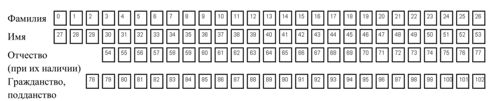

# pdf_editor
University project. 

## This service fills in the fields in the pdf file

FRONTEND - HTML + CSS

BACKEND  - Python Flask

The client has a specific pdf document to fill out.
He fills out the form on the web page. Then form will be sent as POST request on the web server. 

Python Flask implement the web server role.

## Handle process

Web form send the json with 64 parameters. 
The pdf file consist of these parameters.

## Filling process

I have an empty pdf document to fill out. 
To detect rectangles for letters I use __OpenCV__ library for each page of document.
Then when I have all rectangles coordinates I match every json field to rectangles set

I have `CellWriter` class which helps me with cells editing. It looks like Turing machine.
I manipulate my document page with `write_text()` and `write_text_in_cell()` 
```python
    write_text(text: str, start: int, end: int) -> None
```
* __text__ - text that we want to print in cells
* __start__ - the first cell to write
* __end__ - the last cell to write

## Example



>In this case 
> * to fill in lastname we use ```write_text("lastname", 0, 26)``` 
> * to fill in firstname we use ```write_text("firstname", 27, 53)``` 
> * to fill in patronymic we use ```write_text("patronymic", 54, 77)```

```python
    write_text_in_cell(text: str, cell_index: int) -> None
```
This method perform a similar task. But there is only one cell to input.

These are the two main methods on which the entire program is based.

---
## Manual
> All you need to use is run `back/server.py` and next fill in `front/index.html` 
> in your browser